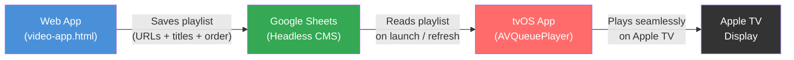

# tvOS Companion App — Architecture Overview

## Architecture Overview

```
┌─────────────────────┐         ┌──────────────────┐         ┌─────────────────┐
│   Your Web App      │         │  Google Sheets    │         │  tvOS App       │
│   (video-app.html)  │────────▶│  (Headless CMS)   │◀────────│  (AVQueuePlayer)│
│                     │  saves  │                  │  reads   │                 │
│  Manage playlists,  │ playlist│  Simple JSON-like │ playlist │  Plays videos   │
│  add/remove videos, │  data   │  rows of URLs +   │  data    │  seamlessly on  │
│  set order/titles   │         │  titles + order   │         │  Apple TV       │
└─────────────────────┘         └──────────────────┘         └─────────────────┘
```



## What You Need

### 1. **tvOS App** (the player)
- **Language:** Swift + SwiftUI (minimal UI needed)
- **Core:** `AVQueuePlayer` with an array of `AVPlayerItem(url:)` 
- **Features:** Plays list of `.mp4` URLs seamlessly, shows current title, skip/prev controls via Siri Remote
- **Complexity:** Surprisingly small — maybe 200-300 lines of Swift
- **Deployment:** Requires Apple Developer account ($99/year), sideload via Xcode to your Apple TV

### 2. **Google Sheets as Headless CMS** (the data bridge)
- Your web app already manages playlists — we'd add a "Publish to Apple TV" button
- That button writes the current playlist (URLs, titles, order) to a Google Sheet
- The tvOS app reads from that same Google Sheet on launch / pull-to-refresh
- **No database, no backend, no server** — Google Sheets API is free and acts as your data store
- Published Sheet → JSON endpoint (Sheets can expose data as JSON natively)

### 3. **Your Existing Web App** (the manager)
- Stays exactly as-is for playlist management, YouTube/Vimeo playback, local playback
- Gets one new button: **"Send to Apple TV"** which pushes the current native-video playlist to the Sheet
- AirPlay continues to work as a fallback for non-native content (YouTube, Vimeo)

## What Will Work Seamlessly

| Content Type | Works in tvOS App? | Why |
|---|---|---|
| Direct `.mp4` URLs | ✅ **Yes — perfectly seamless** | `AVQueuePlayer` handles these natively |
| Dropbox direct links | ✅ **Yes** | These resolve to `.mp4` streams |
| HLS `.m3u8` streams | ✅ **Yes** | AVFoundation's bread and butter |
| YouTube URLs | ❌ **No** | Requires embed player, not raw media |
| Vimeo URLs | ❌ **No** | Same reason |

## What You DON'T Need

- ❌ No complex database (Firebase, Postgres, etc.)
- ❌ No backend server
- ❌ No user authentication system
- ❌ No App Store submission (sideload directly via Xcode for personal use)
- ❌ No redesign of your existing web app

## Black Gap Feature
Easy — insert a 1.5-second black `.mp4` file (or programmatically generated `AVPlayerItem`) between each real video in the queue. `AVQueuePlayer` will play it seamlessly as part of the continuous stream.

## Summary
The tvOS app is essentially a **dumb player** — your web app remains the brain. Google Sheets is the messenger between them. The tvOS app just reads URLs and plays them via `AVQueuePlayer`. No AirPlay involved, no protocol limitations, truly seamless.
